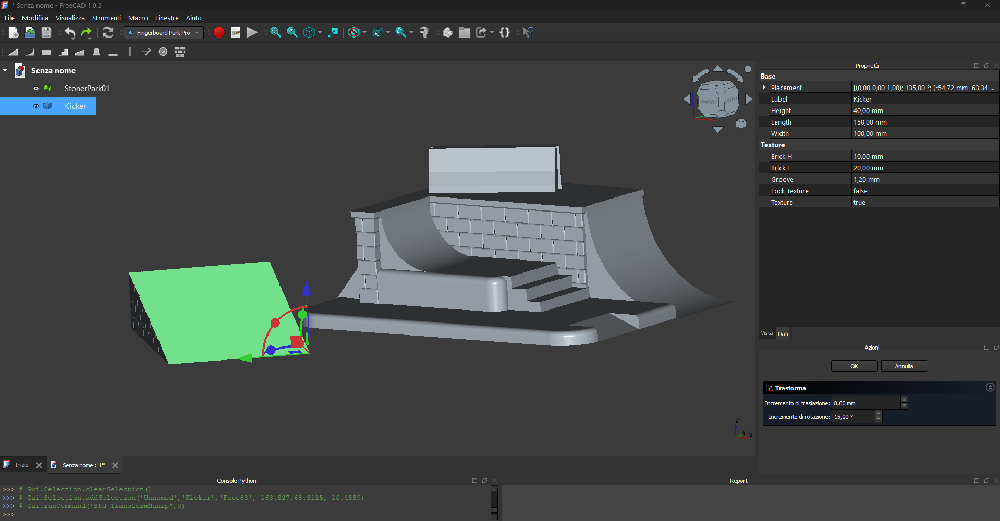
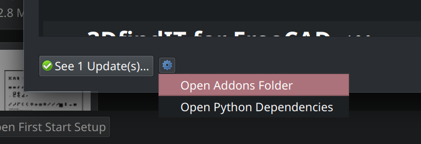

# Fingerboard Park Pro

**Open Source Parametric Park Generator for FreeCAD**

I created this workbench because I was tired of resizing generic STLs. It's time to generate custom obstacles with precise dimensions.
**Fingerboard Park Pro** makes this possible, featuring **real 3D textures**, and a smart system to split large parts for smaller 3D printers.

It's free, open-source, and fully parametric.

## 🚀 Key Features

* **Scalable Workflow**: It usually starts with "I just need a kicker"... and ends with a full park. Designed for the "lazy" maker who wants instant results **and** the architect building a full spot, this workbench is built to handle that creative escalation seamlessly.
* **Fully Parametric**: Adjust Length, Height, Angle, and Width of every obstacle in real-time.
* **Real 3D Textures**: The bricks and tiles are **actual geometry**, not just fake images. When you print them, you can feel the grout lines.
* **Smart Split System**: Printer too small? The "Split Proxy" tool cuts your ramps and automatically inserts **alignment pins** (Male/Female) exactly where you need them.
* **"Bake" Workflow**: Easily convert parametric objects into standard PartDesign Bodies to add your own custom modifications (chamfers, pockets, logos).
* **Skater Details**:
    * **Quarter Pipes**: Option for "Wood Slot" (veneer) and "Coping Slot" (metal rails).
    * **Stairs**: Auto-calculated step height + optional holes for round rails.
    * **Jerseys**: Interlocking joints to build long barriers.

---

## 📦 Installation

Since this workbench is not yet available in the official Addon Manager registry, please install it manually:

1. **Download** this repository as a ZIP file and extract it.

2. **Locate your FreeCAD Addon folder**:
    * Open FreeCAD and launch the **Addon Manager**
    * **Ensure your Addon Manager is up to date**.
    * Click on the **"Open Addon Folder"** option:

3. **Copy** the extracted `FingerboardMoldPro` folder into that directory you just opened.

4. **Restart FreeCAD** to load the new workbench.

---

## 🛠️ How to Build

### 1. Create & Position 
Select the workbench and click on the icons to spawn parametric objects:
* 🧱 **Ledge & Hubba**: Adjustable "Slab" (top stone) and overhang.
* 🪜 **Steps**: Automatically calculates step height based on total height. Includes options for **Rail Holes**.
* 🛹 **Quarter Pipe**: Includes parameters for transition radius, platform length, and coping/veneer slots.
* 🚧 **Jersey Barrier**: Classic concrete shape with optional interlocking ends.
* 📐 **Kicker**: Simple ramp for jumps.
* ⬜ **Base**: Floor generator with customizable tile patterns (Standard or Diamond 45°).
To arrange your park:
* **Right-Click** on the object in the tree -> **Transform**.
* Use the arrows and balls to move and rotate the obstacle into position.
* *Tip:* You can overlap base plates to create complex plazas.

### 2. Advanced Editing
Want to modify an obstacle using standard CAD tools (like adding a custom hole or smoothing an edge)?
1.  Select the obstacle.
2.  Click the **Create Body** icon (Yellow Cube).
3.  A new empty **Body** will appear in the tree.
4.  **Drag and Drop** the obstacle *inside* the new Body.
5.  Now you can use the **PartDesign Workbench** on it!

### 3. Merging Obstacles
To 3D print multiple obstacles as a single piece:
1.  Select the obstacles you want to join (hold Ctrl).
2.  Switch to the **Part Workbench**.
3.  Click **Part -> Boolean -> Union**.
4.  Export the result as STL or ...

### 4. The "Smart Split"
Is yours too big? Don't slice it blindly in your slicer software. Do it properly here:
1.  Click the **Create Split Proxy** icon (Target icon). A red plane with a crosshair will appear.
2.  Move the Proxy (Right-click -> Transform) to where you want the cut. **The crosshair center is where the connector pin will be.**
3.  Select the **Obstacle** first, then select the **Split Proxy** (Ctrl+Click).
4.  Click the **Confirm Split** icon (Scissors).
5.  **Done:** You now have Part A and Part B with a perfect tolerance-fit joint inside.

### 5. Textures (Performance Warning ⚠️)
Calculating hundreds of real bricks takes computer power.
* **Workflow Tip:** Keep textures **OFF** (use the "Texture Toggle" button) while designing and positioning.
* Only turn them **ON** right before exporting to STL.

---

## 🎛️ Parameters Glossary (Data Tab)

* **BrickL / BrickH**: Size of the individual bricks.
* **Groove**: Width of the gap between bricks.
* **LockTexture**: Set to `True` if you want to keep this specific object textured while toggling the others off.
* **RailHoles (Stairs)**: Creates holes for 6mm metal rails.
* **WoodSlot (QuarterPipe)**: Creates a 2mm recess for gluing real wood veneer.
* **UseSlab (Ledge/Hubba)**: Adds a separate "stone" top plate with overhang for realistic grinding.

---

## License
**LGPLv2.1** (Open Source).
Feel free to modify, fork, and improve it.

*Now go build something cool!* 🛹